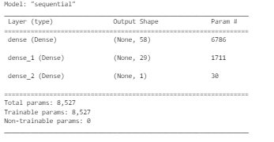

# venture_capital_deep_learning_analysis
This analysis uses feature data from multiple startups and applies deep neural network learning to predict which ones will be successful. 

---

## Technologies

This project leverages python 3.7 with the following packages:

* [pandas] (https://github.com/pandas-dev/pandas) - For data manipulation and analysis.

* [pathlib] (https://github.com/budlight/pathlib) - For importing cvs files using standarized file path notation.

* [tensorflow] (https://github.com/tensorflow/tensorflow) - For building neural networks and deep learning.

* [sklearn] (https://github.com/scikit-learn/scikit-learn) - For machine learning built on top of SciPy.

---

## Datasets

Dataset pulled from Resources folder which contains csv file.

## Usage

### General

This is designed to be run in jupyter lab or Google Collab. Upon launching venture_funding_with_deep_learning.ipynb run each cell sequentially, ensuring to import the required libraries.

### Orginal Deep Learning Model

After prepping and scaling the data this model uses two hidden layers and the "relu" activation function resulting the shape of the model shown below.

This model's results are as shown in the screenshot below.

### Alternative Model 1

In order to optimize our neural network we added an additional two hidden layers to our model resulting in the shape shown below.

This model's accuracy is marginally better when tested against the test data.

### Alternative Model 2

We then tested the removal of each feature from the input data to determine if any of the inputs were confusing the model. We found that removing the STATUS column resulted in a higher accuracy.

### Alternative Model 3

This final model combines multiple optimization strategies including increasing the number of hidden layers, removing "STATUS" input, increasing number of nodes per layer and inreasing the number of epochs from 50 to 100. Show below is the shape of the model.

Although this model showed the highest accuarcy score on the training data it actually showed the lowest score when tried against the test data suggesting that the model was overfit.

